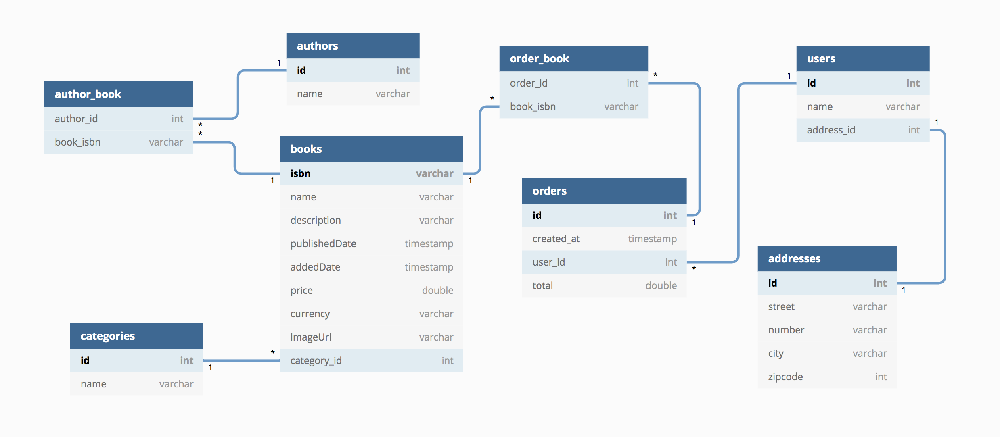

# Database operations using spring data jpa

A book store project in which category, book, author, user, address and order relations are managed. This project includes OneToOne, OneToMany and ManyToMany relationships.

## Tools and technologies utilized in this project:

- Java 8
- Spring
- Maven
- Spring Data JPA
- H2
- Hibernate
- Git
- IntelliJ IDEA

### Sample outputs:

-Craig Walls' books:

[Book{isbn='ba00f523-9caf-4741-9a30-d001fe55e83b', name='Spring in Action', description='Spring Framework', publishedDate=2005-05-05, addedDate=2021-02-02, price=100.5, currency='TL', imageUrl='image1.jpg', category=Category{id=1, name='Computer Science'}, authors=[Author{id=3, name='Craig Walls'}, Author{id=4, name='Ryan Breidenbach'}]}, Book{isbn='658f2124-41bb-415f-b26d-d9c36b53272f', name='Modular Java', description='Java', publishedDate=2009-09-09, addedDate=2021-02-02, price=120.6, currency='TL', imageUrl='image2.jpg', category=Category{id=1, name='Computer Science'}, authors=[Author{id=3, name='Craig Walls'}]}]

-Books including 'spring' word: 

[Book{isbn='ba00f523-9caf-4741-9a30-d001fe55e83b', name='Spring in Action', description='Spring Framework', publishedDate=2005-05-05, addedDate=2021-02-02, price=100.5, currency='TL', imageUrl='image1.jpg', category=Category{id=1, name='Computer Science'}, authors=[Author{id=3, name='Craig Walls'}, Author{id=4, name='Ryan Breidenbach'}]}]

-Users living in Istanbul:

[User{id=8, name='Elif', address=Address{id=9, street='Yunus sokak', number='20', city='Istanbul', zipcode=0}, orders=[Order{id=14, createdDate=2021-02-02, total=105.0, books=[Book{isbn='d5b1158b-ab11-44e9-a5ec-ec267f883449', name='Spring in Action', description='Spring Framework', publishedDate=2005-05-05, addedDate=2021-02-02, price=100.5, currency='TL', imageUrl='image1.jpg', category=Category{id=1, name='Computer Science'}, authors=[Author{id=3, name='Craig Walls'}, Author{id=4, name='Ryan Breidenbach'}]}]}, Order{id=15, createdDate=2021-02-02, total=30.3, books=[Book{isbn='0c649519-39b2-4eab-a047-0a3373347e2b', name='Kurk Mantolu Madonna', description='Madonna', publishedDate=1943-01-01, addedDate=2021-02-02, price=30.3, currency='TL', imageUrl='image3.jpg', category=Category{id=2, name='Novel'}, authors=[Author{id=5, name='Sabahattin Ali'}]}]}]}, User{id=10, name='Rich', address=Address{id=11, street='Lara', number='18', city='Istanbul', zipcode=0}, orders=[]}]

-Burcak's orders: 

[Order{id=12, createdDate=2021-02-02, total=120.6, books=[Book{isbn='658f2124-41bb-415f-b26d-d9c36b53272f', name='Modular Java', description='Java', publishedDate=2009-09-09, addedDate=2021-02-02, price=120.6, currency='TL', imageUrl='image2.jpg', category=Category{id=1, name='Computer Science'}, authors=[Author{id=3, name='Craig Walls'}]}]}, Order{id=13, createdDate=2021-02-02, total=100.5, books=[Book{isbn='ba00f523-9caf-4741-9a30-d001fe55e83b', name='Spring in Action', description='Spring Framework', publishedDate=2005-05-05, addedDate=2021-02-02, price=100.5, currency='TL', imageUrl='image1.jpg', category=Category{id=1, name='Computer Science'}, authors=[Author{id=3, name='Craig Walls'}, Author{id=4, name='Ryan Breidenbach'}]}]}]

